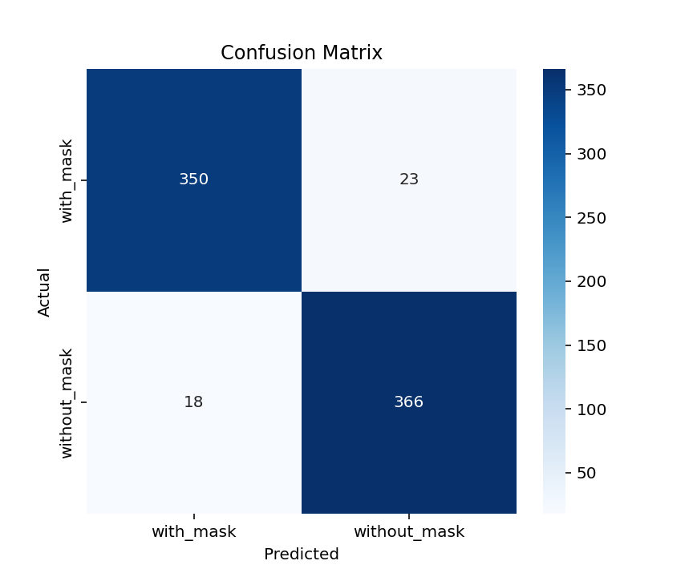

# Face Mask Detection

Bu proje, CNN kullanarak yüz görüntülerinden maskeli veya maskesiz olduğunu tespit eden bir sistemdir.  

## Kullanım

1. Hugging Face linkinden uygulamayı açın:
   [Public Space Link](https://huggingface.co/spaces/xeci/face-mask)
2. Yüz resmi yükleyin.
3. Sistem "Maskeli" veya "Maskesiz" olarak tahmin edecektir.

## Performans

- Validation Accuracy: 94.69%
- Confusion Matrix:
  

## Dosyalar

- `app.py` → Gradio arayüzü
- `Dockerfile` → HF Space deploy
- `requirements.txt` → Paket listesi
- `mask_model.pth` → Eğitilmiş model
- `confusion_matrix.png` → Performans görseli
- `train.py` → Modeli tekrar eğitmek için (opsiyonel)
#   f a c e _ m a s k _ d e t e c t i o n 
 
 